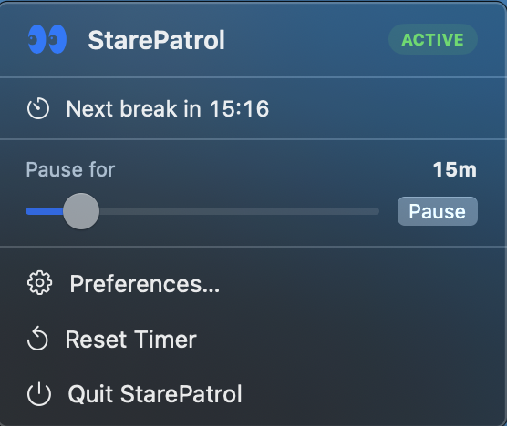
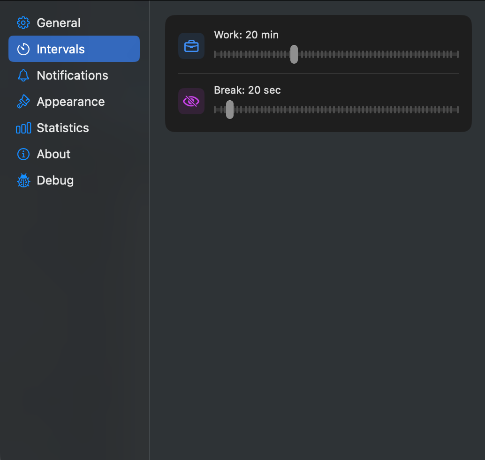

<p align="center">
  
</p>

<h1 align="center">StarePatrol</h1>

<p align="center">
  <strong>A macOS menu bar app that keeps your eyes healthy with the 20-20-20 rule.</strong><br>
  Every 20 minutes, look at something 20 feet away for 20 seconds.
</p>

<p align="center">
  
  
  
</p>

---

## Screenshots

<p align="center">
  
  &nbsp;&nbsp;
  
</p>

<p align="center">
  
  &nbsp;&nbsp;
  
</p>

---

## What is StarePatrol?

Staring at a screen for hours without breaks leads to **digital eye strain** — headaches, blurry vision, and tired eyes. The **20-20-20 rule** is the simplest, most effective remedy: every 20 minutes, look at something 20 feet away for 20 seconds.

StarePatrol lives in your menu bar and enforces this rule silently, with gentle reminders that actually work.

---

## Features

- 🕐 **Configurable intervals** — set your own work and break durations
- 🔔 **Three alert styles** — full-screen takeover, system notification, or silent
- 🔊 **Sounds** — distinct sounds at break start and break end (choose from 8 system sounds)
- ⏸ **Flexible pause** — pause for 1 min up to 2 h, or pause **indefinitely** (∞)
- 🔒 **Strict Mode** — disable skip/snooze for maximum discipline
- 📊 **Statistics** — track breaks taken and skipped over time
- 🚀 **Launch at Login** — starts automatically when you log in
- ✏️ **Customizable message** — change the text shown during breaks
- 🎨 **Customizable menu bar icon** — pick the SF Symbol you like most
- 🖱️ **Haptic feedback** — subtle tap when a break starts

---

## Installation

### Requirements
- macOS 14.0 (Sonoma) or later
- Apple Silicon (arm64)

### Option A — Download pre-built app

Grab `StarePatrol.app` from the [`release/`](release/) folder, move it to `/Applications`, and open it.

> macOS may show a security prompt the first time. Go to **System Settings → Privacy & Security** and click **Open Anyway**.

### Option B — Build from source

```bash
git clone https://github.com/abram0v1ch/StarePatrol.git
cd StarePatrol
make run
```

This compiles, signs ad-hoc, and launches the app automatically. Output is always at `release/StarePatrol.app`.

---

## Usage

StarePatrol appears as an icon in your **menu bar**. Click it to:

- See the countdown to your next break
- Pause the timer — drag the slider all the way to **∞** to pause indefinitely
- Hit **Reset Timer** to restart the countdown immediately
- Open **Preferences…** to configure everything

### Notification setup (recommended)

For `Notification` alert mode, open:
**System Settings → Notifications → StarePatrol** → set style to **Alerts**
so break notifications persist until you dismiss them.

---

## Preferences

| Section | What you can configure |
|---|---|
| **General** | Enable/disable, Launch at Login, Strict Mode |
| **Intervals** | Work duration (1–60 min), break duration (5–300 sec) |
| **Notifications** | Alert style, sound at break start / break end, sound selection, haptics |
| **Appearance** | Menu bar icon, custom reminder message |
| **Statistics** | Breaks taken / skipped count, reset button |
| **Debug** | Trigger an instant break to test settings |

---

## Makefile

```bash
make build   # compile to release/StarePatrol.app
make run     # build + open
make clean   # quit + remove build artifacts
```

---

## Author

Made by **Vasyl Abramovych** — [@abram0v1ch](https://github.com/abram0v1ch)

---

## License

MIT — see [LICENSE](LICENSE) for details.
